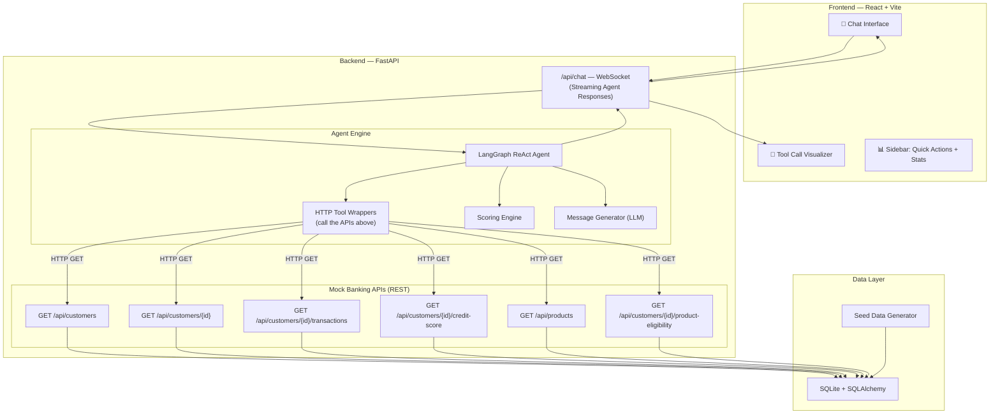
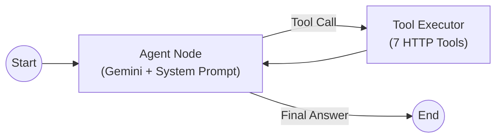
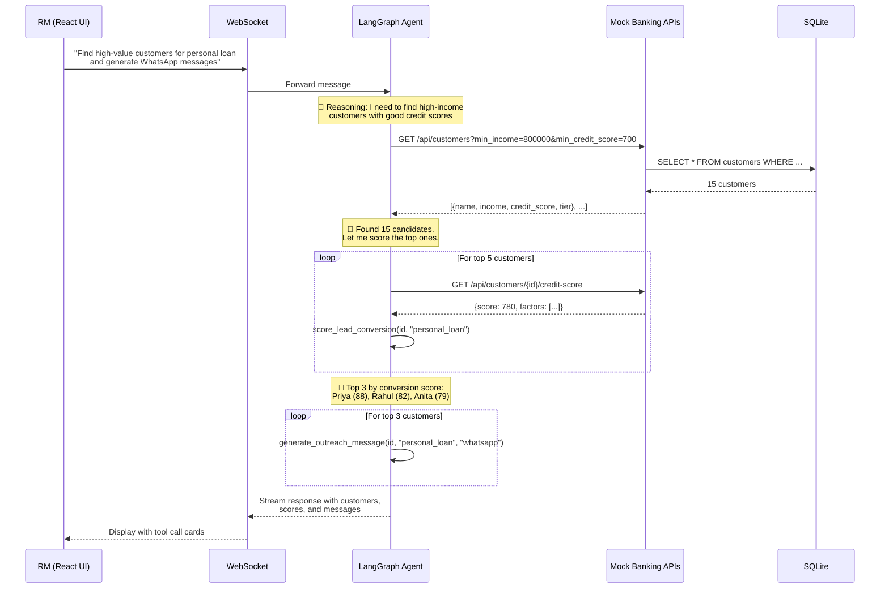

# Agentic AI for Banking CRM — Implementation Plan (v2)

## Problem Statement

Build a conversation-based Agentic AI system that assists a Relationship Manager (RM) in identifying high-potential customers and generating personalized outreach. The system must clearly demonstrate **tool usage**, **task decomposition**, and **structured reasoning**.

---

## Architecture Overview



### Why This Architecture?

The **key insight** for the assignment: the agent doesn't query the DB directly — it calls **real REST APIs as tools**. This clearly demonstrates:
- ✅ **Tool Usage** — Agent makes actual HTTP calls to structured APIs
- ✅ **Task Decomposition** — Agent plans which APIs to call and in what order
- ✅ **Structured Reasoning** — Each tool call is visible, traceable, explainable
- ✅ **Modularity** — APIs, Agent, and UI are fully decoupled

---

## User Review Required

> [!IMPORTANT]
> **LLM Provider**: Using **Google Gemini 2.0 Flash** via `langchain-google-genai`. Free tier available at [aistudio.google.com](https://aistudio.google.com). Architecture is provider-agnostic — can swap to OpenAI/Anthropic in one line.

> [!IMPORTANT]
> **This is a demo project** — optimized for clarity, showcase-ability, and evaluation criteria. Not production-hardened.

---

## Open Questions

1. **Do you have a Gemini API key**, or would you prefer OpenAI/Ollama? I'll default to Gemini.
2. **Any preference on number of demo customers?** I'll default to ~150 with rich transaction histories.

---

## Proposed Changes

### Project Structure

```
banking-agent-ai/
├── README.md                          # Full documentation with architecture diagram
├── .env.example                       # API key template
│
├── backend/
│   ├── requirements.txt               # Python dependencies
│   ├── main.py                        # FastAPI app entry point
│   │
│   ├── config.py                      # Central configuration
│   │
│   ├── data/
│   │   ├── __init__.py
│   │   ├── models.py                  # SQLAlchemy ORM models
│   │   ├── database.py                # DB engine & session
│   │   └── seed.py                    # Synthetic data generator
│   │
│   ├── api/
│   │   ├── __init__.py
│   │   ├── customers.py              # GET /api/customers, GET /api/customers/{id}
│   │   ├── transactions.py           # GET /api/customers/{id}/transactions
│   │   ├── credit_score.py           # GET /api/customers/{id}/credit-score
│   │   ├── products.py               # GET /api/products, GET /api/customers/{id}/product-eligibility
│   │   └── schemas.py                # Pydantic response schemas
│   │
│   ├── agent/
│   │   ├── __init__.py
│   │   ├── tools.py                  # LangChain tools that call the REST APIs
│   │   ├── scoring.py                # Conversion scoring engine
│   │   ├── message_generator.py      # LLM-powered outreach generator
│   │   ├── graph.py                  # LangGraph agent definition
│   │   ├── state.py                  # Agent state definition
│   │   └── prompts.py                # System prompts
│   │
│   └── tests/
│       ├── test_api.py               # API endpoint tests
│       ├── test_tools.py             # Tool integration tests
│       └── test_scoring.py           # Scoring engine tests
│
└── frontend/
    ├── package.json
    ├── vite.config.js
    ├── index.html
    └── src/
        ├── main.jsx                  # App entry
        ├── App.jsx                   # Root component with layout
        ├── index.css                 # Global styles & design system
        │
        ├── components/
        │   ├── ChatInterface.jsx     # Main chat area
        │   ├── MessageBubble.jsx     # Individual message display
        │   ├── ToolCallCard.jsx      # Expandable tool invocation display
        │   ├── Sidebar.jsx           # Quick actions + portfolio stats
        │   ├── CustomerCard.jsx      # Customer summary card
        │   └── LoadingIndicator.jsx  # Streaming/thinking indicator
        │
        └── hooks/
            └── useChat.js            # WebSocket chat hook
```

---

### Component 1: Mock Banking APIs (FastAPI)

These are **real REST endpoints** that return structured JSON. The agent calls them as tools.

#### [NEW] [customers.py](file:///d:/Development/banking-agent-ai/backend/api/customers.py)

| Endpoint | Description | Query Params | Response |
|----------|-------------|-------------|----------|
| `GET /api/customers` | List/filter customers | `min_income`, `min_credit_score`, `tier`, `city`, `has_product`, `limit` | `[{id, name, age, income, tier, credit_score, city, ...}]` |
| `GET /api/customers/{id}` | Full customer profile | — | `{id, name, demographics, products, recent_interactions, account_summary}` |

#### [NEW] [transactions.py](file:///d:/Development/banking-agent-ai/backend/api/transactions.py)

| Endpoint | Description | Query Params | Response |
|----------|-------------|-------------|----------|
| `GET /api/customers/{id}/transactions` | Transaction history | `months`, `category`, `min_amount` | `{transactions: [...], summary: {total_credit, total_debit, avg_balance}}` |

#### [NEW] [credit_score.py](file:///d:/Development/banking-agent-ai/backend/api/credit_score.py)

| Endpoint | Description | Response |
|----------|-------------|----------|
| `GET /api/customers/{id}/credit-score` | Credit score + breakdown | `{score, rating, factors: [{name, impact, detail}]}` |

#### [NEW] [products.py](file:///d:/Development/banking-agent-ai/backend/api/products.py)

| Endpoint | Description | Response |
|----------|-------------|----------|
| `GET /api/products` | All available banking products | `[{id, name, type, min_income, min_credit_score, features}]` |
| `GET /api/customers/{id}/product-eligibility` | Products customer qualifies for | `[{product, eligible, fit_score, reasons}]` |

#### [NEW] [schemas.py](file:///d:/Development/banking-agent-ai/backend/api/schemas.py)

Pydantic models for all API responses — ensures typed, documented responses.

---

### Component 2: Agent Tools (HTTP Wrappers)

Each tool is a LangChain `@tool` function that makes an HTTP request to the banking APIs. This is the **core demonstration of tool usage**.

#### [NEW] [tools.py](file:///d:/Development/banking-agent-ai/backend/agent/tools.py)

```python
# Each tool calls a real API endpoint — demonstrating structured tool usage

@tool
def search_customers(min_income: int = None, min_credit_score: int = None, 
                     tier: str = None, city: str = None) -> str:
    """Search for customers matching specific criteria.
    Use this to find high-value customer segments."""
    response = httpx.get(f"{API_BASE}/api/customers", params={...})
    return response.json()

@tool  
def get_customer_profile(customer_id: int) -> str:
    """Get detailed profile for a specific customer including demographics,
    account summary, existing products, and recent interactions."""
    response = httpx.get(f"{API_BASE}/api/customers/{customer_id}")
    return response.json()

@tool
def get_customer_transactions(customer_id: int, months: int = 6) -> str:
    """Fetch transaction history and spending analysis for a customer."""
    response = httpx.get(f"{API_BASE}/api/customers/{customer_id}/transactions", 
                         params={"months": months})
    return response.json()

@tool
def get_credit_score(customer_id: int) -> str:
    """Get credit score and detailed factor breakdown for a customer."""
    response = httpx.get(f"{API_BASE}/api/customers/{customer_id}/credit-score")
    return response.json()

@tool
def check_product_eligibility(customer_id: int) -> str:
    """Check which banking products a customer is eligible for,
    with fit scores and reasoning."""
    response = httpx.get(f"{API_BASE}/api/customers/{customer_id}/product-eligibility")
    return response.json()

@tool
def score_lead_conversion(customer_id: int, product_type: str) -> str:
    """Score a customer's likelihood to convert for a specific product.
    Returns score (0-100), confidence level, and contributing factors."""
    # Calls the scoring engine (internal, not REST)
    return scoring_engine.score(customer_id, product_type)

@tool
def generate_outreach_message(customer_id: int, product_type: str, 
                              channel: str = "whatsapp") -> str:
    """Generate a personalized outreach message for a customer.
    Channel options: whatsapp, email, sms."""
    # Calls LLM with customer context for personalization
    return message_generator.generate(customer_id, product_type, channel)
```

**Why HTTP tools?** The evaluator can see the agent making *real API calls* to *real endpoints*. Each call is logged, traceable, and independently testable. This is much stronger than direct DB queries.

---

### Component 3: Scoring Engine

#### [NEW] [scoring.py](file:///d:/Development/banking-agent-ai/backend/agent/scoring.py)

Rule-based heuristic scoring — **transparent and explainable** (evaluators can see exactly why a score was given).

```
Conversion Score = weighted_sum of:
┌──────────────────────────┬────────┬─────────────────────────────────────┐
│ Factor                   │ Weight │ Logic                               │
├──────────────────────────┼────────┼─────────────────────────────────────┤
│ Income Adequacy          │ 0.20   │ income vs product minimum           │
│ Credit Score             │ 0.20   │ 750+ = high, 650-750 = med         │
│ Spending Capacity        │ 0.15   │ disposable income after EMIs        │
│ EMI Burden               │ 0.15   │ existing EMI / income ratio         │
│ Engagement Recency       │ 0.10   │ days since last interaction         │
│ Product Gap              │ 0.10   │ doesn't already own product         │
│ Relationship Tenure      │ 0.05   │ years as customer                   │
│ Recent Salary Growth     │ 0.05   │ salary trend in transactions        │
└──────────────────────────┴────────┴─────────────────────────────────────┘

Output: { score: 82, label: "High", factors: [...], explanation: "..." }
```

---

### Component 4: LangGraph Agent

#### [NEW] [graph.py](file:///d:/Development/banking-agent-ai/backend/agent/graph.py)



ReAct pattern: the agent **reasons** about what to do, **acts** by calling tools, **observes** results, and **repeats** until it has enough info to respond.

#### [NEW] [prompts.py](file:///d:/Development/banking-agent-ai/backend/agent/prompts.py)

```
You are an AI assistant for a Banking Relationship Manager (RM).

You help RMs identify high-potential customers and generate personalized outreach.

AVAILABLE TOOLS:
- search_customers: Find customers by criteria (income, credit score, tier, city)
- get_customer_profile: Get full 360° view of a customer
- get_customer_transactions: Analyze spending patterns and transaction history  
- get_credit_score: Check credit score with factor breakdown
- check_product_eligibility: See which products a customer qualifies for
- score_lead_conversion: Score conversion probability for a product
- generate_outreach_message: Create personalized WhatsApp/Email/SMS messages

WORKFLOW GUIDELINES:
1. ALWAYS start by searching for relevant customers using search_customers
2. For each promising customer, fetch their profile and credit score
3. Use score_lead_conversion to rank candidates
4. Only generate outreach for customers with high conversion scores
5. Explain your reasoning at each step — the RM needs to understand WHY

Be data-driven. Always cite specific numbers from the tools.
```

#### [NEW] [state.py](file:///d:/Development/banking-agent-ai/backend/agent/state.py)

```python
class AgentState(TypedDict):
    messages: Annotated[list, add_messages]
```

Simple state — conversation history only. LangGraph's message-based state handles context automatically.

---

### Component 5: React Frontend

#### Design Philosophy
- **Dark theme** with glassmorphism accents
- **Tool call transparency** — every API call the agent makes is visible as an expandable card
- **Smooth animations** — typing indicators, message transitions, tool call reveals

#### [NEW] [App.jsx](file:///d:/Development/banking-agent-ai/frontend/src/App.jsx)

Layout: Sidebar (left) + Chat Area (center/right)

#### [NEW] [ChatInterface.jsx](file:///d:/Development/banking-agent-ai/frontend/src/components/ChatInterface.jsx)

- WebSocket connection to `/api/chat`
- Streams agent responses token-by-token
- Renders tool calls inline between message chunks

#### [NEW] [ToolCallCard.jsx](file:///d:/Development/banking-agent-ai/frontend/src/components/ToolCallCard.jsx)

The **star component** — shows each tool invocation:
```
┌─────────────────────────────────────────┐
│ 🔧 search_customers                     │
│ ├─ Params: {min_income: 800000, ...}    │
│ ├─ Status: ✅ Success (120ms)           │
│ └─ ▶ View Response (expandable)         │
└─────────────────────────────────────────┘
```

#### [NEW] [Sidebar.jsx](file:///d:/Development/banking-agent-ai/frontend/src/components/Sidebar.jsx)

- **Quick Action Buttons** for 3 demo scenarios
- Portfolio summary stats
- "New Conversation" button

#### [NEW] [useChat.js](file:///d:/Development/banking-agent-ai/frontend/src/hooks/useChat.js)

Custom hook managing:
- WebSocket lifecycle
- Message state (user messages, agent messages, tool calls)
- Streaming buffer
- Connection status

---

### Component 6: Data Layer

#### [NEW] [models.py](file:///d:/Development/banking-agent-ai/backend/data/models.py)

| Model | Key Fields |
|-------|-----------|
| `Customer` | id, name, age, gender, occupation, annual_income, credit_score, tier, phone, email, city, existing_products (JSON), kyc_status, assigned_rm_id |
| `Transaction` | id, customer_id, date, type, category, amount, balance_after, channel, description |
| `Product` | id, name, type, min_income, min_credit_score, interest_rate, features (JSON) |
| `Interaction` | id, customer_id, date, channel, type, product_discussed, outcome, notes |

#### [NEW] [seed.py](file:///d:/Development/banking-agent-ai/backend/data/seed.py)

Generates ~150 customers with:
- Indian names, cities (Mumbai, Delhi, Bangalore, Chennai, Pune, Hyderabad)
- 12 months of realistic transaction patterns
- Credit scores distributed realistically (600-850)
- Some customers with clear conversion signals (high income + no personal loan + good credit)
- Product ownership patterns (savings account for all, FD/credit card/loan for some)

---

## Execution Flow (Primary Use Case)



---

## 3 Demo Use Cases

| # | User Query | Tools Called | What It Demonstrates |
|---|-----------|-------------|---------------------|
| 1 | *"Find high-value customers likely to convert for a personal loan this month and generate WhatsApp messages"* | `search_customers` → `get_credit_score` → `score_lead_conversion` → `generate_outreach_message` | Full pipeline: search → analyze → score → generate |
| 2 | *"Show me the complete profile and spending analysis for customer Priya Sharma"* | `get_customer_profile` → `get_customer_transactions` → `check_product_eligibility` | Deep-dive into single customer with cross-sell |
| 3 | *"Which Gold tier customers in Mumbai should I target for credit card upgrades?"* | `search_customers` → `get_credit_score` × N → `score_lead_conversion` × N → `generate_outreach_message` × N | Segment-based campaign with bulk outreach |

---

## Key Design Decisions

| Decision | Choice | Rationale |
|----------|--------|-----------|
| **API-as-Tools** | Agent calls REST APIs via HTTP | Clearly demonstrates tool usage; each call is logged and visible |
| **FastAPI + React** | Decoupled frontend/backend | Modular, industry-standard, impressive for demo |
| **Single ReAct Agent** | One agent, 7 tools | Clear reasoning flow; tools provide specialization |
| **WebSocket Streaming** | Real-time token streaming | Professional UX; shows agent "thinking" |
| **Rule-based Scoring** | Weighted heuristics | Transparent, explainable, no training needed |
| **Synthetic Data** | Faker + custom patterns | Self-contained demo, no PII concerns |
| **Tool Call Visualization** | Expandable cards in chat | Evaluator can see exactly what the agent did |

---

## Trade-offs & Limitations

| Aspect | Trade-off |
|--------|-----------|
| **HTTP Tools vs Direct DB** | Slightly slower (HTTP overhead), but dramatically clearer for demonstrating tool usage |
| **Rule-based vs ML Scoring** | Less accurate but fully explainable — evaluator sees factor breakdown |
| **Single Agent vs Multi-Agent** | Simpler flow but less scalable; sufficient for demo scope |
| **SQLite vs PostgreSQL** | Not production-grade but zero-setup for evaluators |
| **No Auth/RBAC** | Demo project — noted as limitation in README |
| **Gemini dependency** | Needs API key; documented how to swap providers |

---

## Tech Stack Summary

| Layer | Technology |
|-------|-----------|
| Frontend | React 18 + Vite, Vanilla CSS (dark theme) |
| Backend | FastAPI, Python 3.11+ |
| Agent | LangGraph + LangChain |
| LLM | Google Gemini 2.0 Flash |
| Database | SQLite + SQLAlchemy |
| Data Gen | Faker (Indian locale) |
| Transport | WebSocket (streaming), REST (APIs) |

---

## Verification Plan

### Automated Tests
```bash
cd backend
pytest tests/ -v                    # API + tool + scoring tests
python -c "from agent.graph import create_agent; print('OK')"  # Import check
```

### Manual Verification
1. `cd backend && uv run uvicorn main:app --reload` — APIs at http://localhost:8000
2. `cd frontend && pnpm dev` — UI at http://localhost:5173
3. Test all 3 demo use cases via the Quick Action buttons
4. Verify tool call cards appear for every API call
5. Verify outreach messages are personalized (mention customer name, specific data)
6. Test conversational follow-ups ("tell me more about customer #2")

### API Verification
```bash
curl http://localhost:8000/api/v1/customers?limit=5
curl http://localhost:8000/api/v1/customers/1
curl http://localhost:8000/api/v1/customers/1/transactions
curl http://localhost:8000/api/v1/customers/1/credit-score
curl http://localhost:8000/api/v1/products
curl http://localhost:8000/api/v1/customers/1/product-eligibility
```
