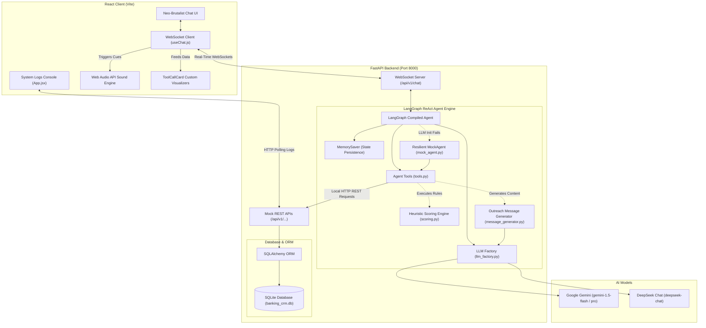
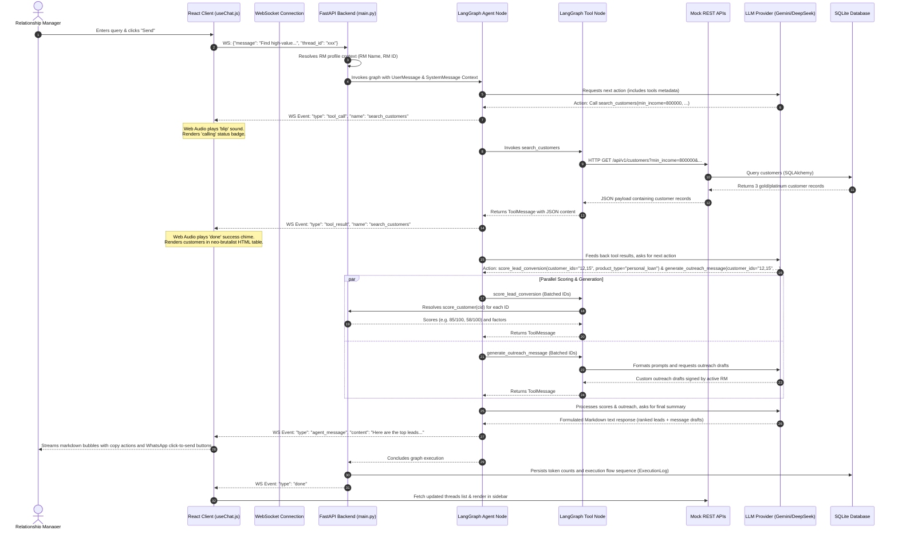

# 🏦 System Architecture & Comprehensive Analysis Report

This report provides a detailed breakdown of the technical design, execution flow, tool usage, and deployment configuration of the **Agentic AI for Banking CRM** platform.

---

## 🏗️ 1. Architecture Diagram

The system is decoupled into three primary tiers: **React Frontend (Neo-Brutalist Chat & Telemetry Console)**, **FastAPI Backend (Mock REST APIs & LangGraph Agent Engine)**, and **LLM Provider Services**.

The following diagram illustrates the component architecture and communication paths:



---

## 🔄 2. Execution Flow

The communication sequence diagram below details a multi-turn, tool-assisted agent request:
*"Find high-value customers likely to convert for a personal loan this month and generate WhatsApp messages"*



---

## 🛠️ 3. Tool Design and Usage

Decoupling the AI Agent from the database is a core architectural highlight. The agent leverages **7 primary tools** defined in `backend/agent/tools.py`.

### Batch Processing (Optimization)
Unlike standard ReAct agents that invoke tools sequentially in a loop (generating huge token overhead and latency), all retrieve/compute tools in this platform accept a comma-separated string of IDs (`customer_ids`). 
* **Mechanism**: The tool parses the string, issues parallel or batched sub-actions, and merges the responses into a single JSON array returned to the LLM.
* **Benefits**: Saves up to **75% of LLM round-trips** and prevents prompt-length explosion.

### The 7 Agent Tools:
| Tool Name | Parameters | Target Endpoint / Internal Service | Output Structure |
|---|---|---|---|
| **`search_customers`** | `min_income`, `min_credit_score`, `tier`, `city`, `without_product`, `limit` | `GET /api/v1/customers` | JSON list of customer summaries meeting the criteria. |
| **`get_customer_profile`** | `customer_id`, `customer_ids` (comma-separated string) | `GET /api/v1/customers/{id}` | Detailed 360° demographics, active products, and relationship details. |
| **`get_customer_transactions`** | `customer_id`, `customer_ids`, `months` | `GET /api/v1/customers/{id}/transactions` | 6-month debits/credits summary, category breakdown, and recent list. |
| **`get_credit_score`** | `customer_id`, `customer_ids` | `GET /api/v1/customers/{id}/credit-score` | Credit score number, rating, and factor breakdown (e.g. repayment history). |
| **`check_product_eligibility`** | `customer_id`, `customer_ids` | `GET /api/v1/customers/{id}/product-eligibility` | Pre-qualification status and fit scores for 6 core banking products. |
| **`score_lead_conversion`** | `customer_id`, `customer_ids`, `product_type` | `score_customer` heuristic engine in `scoring.py` | Multi-factor weighted score (0-100), high/med/low label, and key drivers. |
| **`generate_outreach_message`** | `customer_id`, `customer_ids`, `product_type`, `channel` | LLM prompt or template fallback in `message_generator.py` | Contextual SMS, Email, or WhatsApp draft signed off by the active RM. |

---

## 🎨 4. Key Design Decisions

1. **API-as-Tools Interface**
   Instead of querying the database directly using SQL or ORM code inside the tools, the agent calls REST API endpoints via the `httpx` client. This reflects a real-world enterprise environment where agents interact with legacy core banking services via gateway endpoints rather than direct DB writes/reads.
2. **Explainable Rule-Based Heuristic Engine**
   Instead of a black-box ML model, the conversion likelihood scoring uses weighted rule-based scoring configured per product type:
   * **Factors Evaluated**: *Income Adequacy (20%), Credit score (20%), Spending Capacity (15%), EMI Burden (15%), Engagement Recency (10%), Product Gap (10%), Relationship Tenure (5%), and Salary Trend (5%)*.
   * **Benefit**: Complete compliance-friendly transparency. Relationship Managers can see the exact breakdown of weights and drivers in the UI popup.
3. **Resilient MockAgent Fallback**
   If the user runs the app without a valid LLM API key, initialization catches the error and compiles a `MockAgent` instead. It parses incoming queries with regex and triggers the actual tools in the background to return real data. This ensures the app is 100% demo-ready and testable with zero dependencies.
4. **WebSocket-Based Streaming Channel**
   Because agent reasoning processes and multi-step tool calls can take several seconds, a standard HTTP request would cause browser timeouts or stagnant spinner screens. WebSockets stream JSON event updates live as they happen: `tool_call` (display start) ➔ `tool_result` (display visual card) ➔ `agent_message` (stream response text) ➔ `done` (refresh state).
5. **Neo-Brutalist Aesthetic styling**
   The application avoids boring, generic dashboard layouts in favor of a modern neo-brutalist theme: thick black borders (`border-3 border-black`), sharp drop shadows (`shadow-brutal-lg`), high-contrast pastel accent badges, and synthesised retro audio alerts for tool call state transitions via the Web Audio API.

---

## ⚖️ 5. Trade-offs and Limitations

* **Synchronous HTTP Client Overhead**
  * *Trade-off*: Using `httpx.Client` (synchronous) simplifies tool wrappers and keeps code easy to read, but blocks thread loops. 
  * *Limitation*: For high-concurrency production usage, these would need to be rewritten using `httpx.AsyncClient` to avoid bottlenecks during parallel API hits.
* **In-Memory Graph checkpointer**
  * *Trade-off*: `MemorySaver` provides zero-configuration context persistence for conversation threads.
  * *Limitation*: Checkpoints are kept in-memory; restarting the FastAPI process clears conversational memory, although SQLite continues to retain user threads and execution logs. Production setups should use a relational checkpointer like `PostgresSaver`.
* **Static Scoring Weights**
  * *Trade-off*: Weighted percentages are set statically in `scoring.py`. This is highly explainable and simple to change.
  * *Limitation*: It does not adapt to seasonal trends or customer response patterns automatically. It requires developer edits or a separate database configuration table to modify weights.

---

## 🚀 6. Setup and Run Instructions

### Option A: Local Development Setup (Quickest)

This setup runs backend and frontend services locally with hot-reloading enabled.

#### Prerequisites:
* Python 3.12+ (managed via `uv`)
* Node.js 18+ (managed via `pnpm` or `npm`)
* Google Gemini API Key or DeepSeek API Key

#### Steps:
1. **Clone & Configure**:
   ```bash
   git clone <repository_url>
   cd banking-agent-ai
   cp .env.example .env
   # Open .env and populate GOOGLE_API_KEY or DEEPSEEK_API_KEY
   ```
2. **Launch with PowerShell Developer Script**:
   Windows users can start both services with a single command:
   ```powershell
   # Run from the root of banking-agent-ai
   .\start-dev.ps1
   ```
   *This script checks environment variables, installs missing packages (`uv sync` and `pnpm install`), and opens two separate terminal windows running backend (port 8000) and frontend (port 5173).*

3. **Manual Launch (Fallback)**:
   * **Backend**:
     ```bash
     cd backend
     uv sync
     uv run uvicorn main:app --reload --host 127.0.0.1 --port 8000
     ```
   * **Frontend**:
     ```bash
     cd frontend
     pnpm install
     pnpm dev
     ```

---

### Option B: Containerized Production Setup (Docker Compose)

Runs the services inside fully decoupled Docker containers.

#### Steps:
1. **Prepare Environment**:
   Ensure your `.env` file in the root directory contains the desired API key and configuration:
   ```ini
   LLM_PROVIDER=gemini
   GOOGLE_API_KEY=AIzaSy...
   LLM_MODEL=gemini-1.5-flash
   ```
2. **Build and Start**:
   ```bash
   cd deploy
   docker-compose up --build -d
   ```
3. **Verify running containers**:
   ```bash
   docker ps
   ```
   * *Frontend will be exposed on: `http://localhost` (Port 80)*
   * *Backend will be exposed on: `http://localhost:8000`*
   * *SQLite database will persist in the named docker volume `backend-data`.*

4. **Shutdown Services**:
   ```bash
   docker-compose down
   ```
